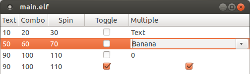
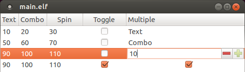
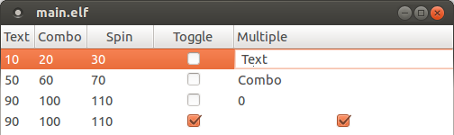

snippets_gtk
============

A code snippet used to have a toggle, a text field, a spin and a combo in different rows of the same column in a GtkTreeView.





Installation
-----------

```
make all

./bin/main.elf
```
